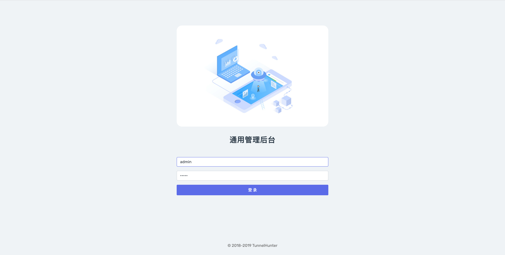
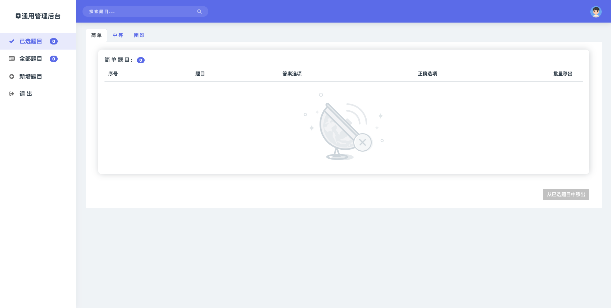
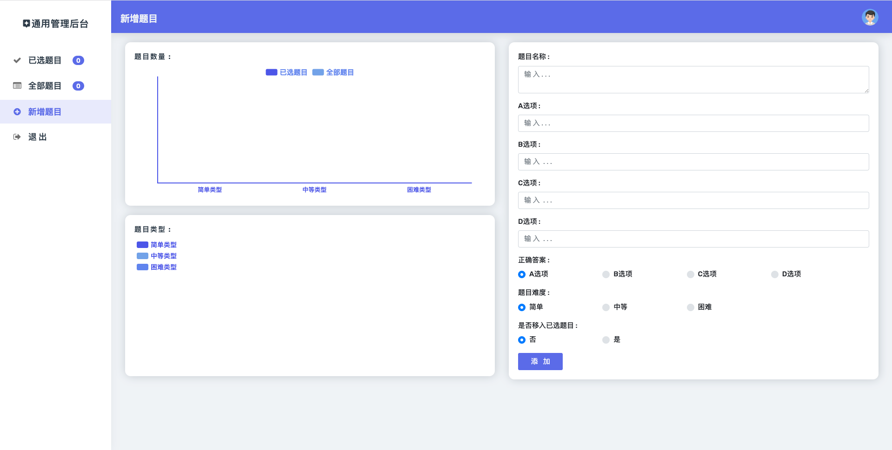

# universal-admin-website-template

Universal Admin Website Template

## How to use

```js
git clone https://github.com/TunnelHunter/universal-admin-website-template.git

npm install
```

## Screenshot




